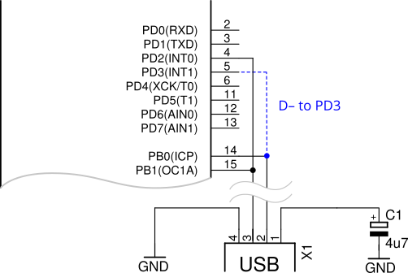

# avr revisited

Of course, it is 2025, so there are more, cheaper and better controllers around, but (as prof. Gershenfeld remarked during Fabacademy) it makes sense on this planet to first use your old stock. 

## programmer: usbasp

The usbasp programmer sources can be found on [the usbasp project site](https://fischl.de/usbasp/). Many 'clones' and derivatives exist. Typically with an ATmega8, 48, 88. Hardware might differ with switches and jumpers for updating firmware (typically with tweezers holding a reset pin) and/or jumpers to put power supply (5V) through. 

The source of one of the latest version can be obtained from aforementioned website. Hardware is found in many different versions. 

### zhifengsoft

this cheap usbasp - or avrispmkII programmer is out-of-the box not programmed with standard usbasp software, but registers as USBHID with a usb PID that is recognised as originating from Atmel

It -could- run the original usbasp firmware, however, there is a catch, a pin (PD3) is used to draw the D- signal low. With this in place USB will not work



three options exists: 
- desolder a 0R resistor on the board
- edit the hexfile
- recompile the usbasp code to use PD3 as input. 

[source](https://irq5.io/2017/07/25/making-usbasp-chinese-clones-usable/)

```c
/* all outputs except PD2 = INT0 */
DDRD = ~(1 << 2);
```

will be replaced with

```c
DDRD &= ~((1<<2) | (1<<3));
```

Furthermore, the sources need to be adapted to work with modern version of avr-gcc. This means that every variable in `PROGMEM` also has to be declared `const` and a clear separation between header file (declare a variable `extern`) and c-file (initialise the variable) in order to make variables link well. 

Apart from that, the makefile needs to include the right settings for the used uC (atmega8, 88, etc) and right clockspeed (12 MHz to work with USB)

The invocation (for this controller, using atmega88) for programming would be: 

```bash 
avrdude -c usbasp -p m88 -U flash:w:main.hex 
```

and the right invocation to set the fusebits: 

```bash
avrdude -c usbasp -p m88 \                   
  -U lfuse:w:0xFF:m -U hfuse:w:0xDF:m -U efuse:w:0xF9:m
```

The check to see a registered usb device (`lsusb`) on mac would be `system_profiler SPUSBDataType`

## programmer: usbprog

Similar to adapting the sources for the usbasp, also for usbprog the avrgcc compiler has become more restrictive. Again: 
- add `const` with every `PROGMEN`
- make declarations in headers `extern` and make sure there is one initialisation in the accompanying *.c file

For now I only reworked the avrispmkII clone software, in the original project (not longer original, but a copy is found on github [usbprog-tools](https://github.com/bwalle/usbprog-tools)  and [usbprog](https://github.com/ykhalyavin/usbprog))

Although the code compiles and the programmer registers as avrisp, it will not work on MacOS (to do with HID/device registration)

## board: rtavr
### bootloader: optiboot for Atmega32

RTAVR has been designed in 2002 for the CreaTech competitions. Initially equipped with the AT90s8535 at 8MHz current versions sport an ATmega32u16 running at 16 MHz.

The optiboot bootloader source works well. It can be compiled using 

```bash
make atmega32 AVR_FREQ=16000000L BAUD_RATE=57600 LED=B0
```

programming this bootloader and setting the fuse bits, for example using an usbasp:

```bash
avrdude -c usbasp -p m32 \
  -U flash:w:optiboot_atmega32.hex \
  -U lfuse:w:0xFF:m -U hfuse:w:0xC8:m
```

Code example is given in the rtavr directory with in the platformio.ini file:

```ini
[env:atmega32_rtavr]
platform = atmelavr
board = ATmega32
framework = arduino
lib_deps = arduino-libraries/LiquidCrystal@^1.0.7
board_build.mcu = ATmega32
board_build.f_cpu = 16000000L
upload_protocol = arduino
upload_port = /dev/tty.usbserial-21320
upload_speed = 57600
```

Optiboot (with serial connection) is initialised by pressing the reset button, causing a 1 second check on the serial port. It also fires (only when DTR is connected) through a 100nF capacitor as implemented with the ottantotto board.

### settings

There are a number of jumpers 

j17 - power: left (close to switch) - use regulator
j17 - power: right (close to right edge) - bypass regulator

j23 - backlight connection for LCD
j20 - PC3 / connect a buzzer
j11 - AREF to VCC
j16 - test potentiometer
j14 - test button
j15 - test button

note: on the bottomside there is a single jumper to connect the analog ground plane and power ground plane. This should sport a 0-R resistor or bridge

Besides swapping out the crystal (8MHz vs 16MHz) on the current boards (in order to work with the optiboot bootloader) the capacitor next to the reset switch needs to be removed. 

## board: ottantotto

The ottantotto (and also LED dimmer boards) have been using ATmega88 (which were at the time a bit more price efficient than ATmega168 or ATmega328)

They are typically used without bootloader (to save the sparse 8k flash) and programmed using ISP

However, optiboot can be configured for this controller too: 

```ini
[env:atmega168_optiboot]
platform = atmelavr
board = atmega168
framework = arduino
board_build.mcu = atmega168
board_build.f_cpu = 16000000L
upload_protocol = arduino
upload_port = /dev/cu.usbserial-21320
upload_speed = 115200
```

and for configuring optiboot: 

```bash
make atmega168 AVR_FREQ=16000000L BAUD_RATE=115200 LED=B5
```

and for uploading:

```bash
avrdude -c usbasp -p m168 \
  -U flash:w:optiboot_atmega168.hex \
  -U lfuse:w:0xFF:m -U hfuse:w:0xDC:m -U efuse:w:0xF8:m
```


(or for an 88 version)
```bash
make atmega88 AVR_FREQ=16000000L BAUD_RATE=57600 LED=B5
```

and 

```bash
avrdude -c usbasp -p m88 \
  -U flash:w:optiboot_atmega88.hex \
  -U lfuse:w:0xE2:m -U hfuse:w:0xDC:m -U efuse:w:0xF9:m
```

